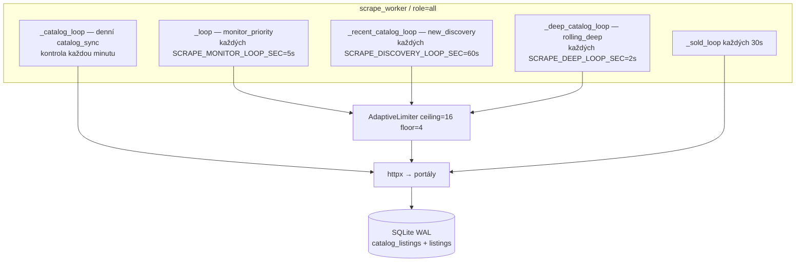

# Scraping v Realitify — celý proces

Tento dokument popisuje, jak Realitify stahuje inzeráty z 10 českých portálů, jak je ukládá do SQLite, jak z nich skládá katalog v appce a jak se brání rate limitům. Je to mapa kódu, ne marketingový přehled.

Související testy: `tests/test_scrape_engine.py`, `tests/test_scrape_pipeline.py`, `tests/test_catalog_shards.py`, `tests/test_batch_upsert.py`, `tests/test_sources.py`.

---

## 1. Co scraping dělá

Cíl je držet lokální kopii trhu bytů (pronájem + prodej) a nad ní:

1. **Katalog v UI** (`/nabidka`, `/api/catalog`) — listování, mapa, filtry.
2. **Hlídací psi** (`monitors`) — uživatelovo hledání; nové / zlevněné byty jdou do Discord / e-mail / push.
3. **Veřejné stránky** — statistiky, „zmizelé“ pronájmy, hry.

Scraping **není** v HTTP requestu uživatele. Uživatel čte SQLite. Worker tahá portály na pozadí a zapisuje. Web proces jen čte (a občas zapíše nastavení / účet).

---

## 2. Procesy a role (`SCRAPE_ROLE`)

Tři režimy v `app/config.py`:

| Role | Proces | Co běží |
|---|---|---|
| `web` | uvicorn `app.main:app` | FastAPI, digest, ping fronta, prune. **Žádný list crawl.** |
| `worker` | `python -m app.scrape_worker` | Tři crawl pipeline + sold + coords + dedupe. Žádný HTTP server. |
| `all` | jeden uvicorn | Legacy: web i scrape v jednom procesu (blokuje event loop). |

### Lokálně

`make dev` → `app/run_dev.py`:

- spawne uvicorn s `SCRAPE_ROLE=web` (`--reload`)
- spawne `python -m app.scrape_worker` s `SCRAPE_ROLE=worker`
- worker pid do `.run/scrape_worker.pid`
- únik: `SCRAPE_ROLE=all make dev` (jeden proces, TTFB stránek skáče na desítky sekund)

### Produkce (Railway)

`supervisord.conf` + `railpack.toml`:

```
[program:web]     uvicorn …  environment=SCRAPE_ROLE="web"
[program:worker]  python -m app.scrape_worker  environment=SCRAPE_ROLE="worker"
```

Oba procesy sdílí **jeden soubor** `data/monitor.sqlite` (na Railway volume `/data`). Komunikace mezi webem a workerem je přes `meta` tabulku (fronta ručního scrape / catalog sync), ne přes síť.

### Start Hubu (`app/monitor.py` `Hub.start`)

```
role=worker  → start() ihned return; smyčky startuje ScrapeWorker.run()
role=all     → monitor loop + sold + catalog sync + new_discovery + rolling_deep
               + coords + dedupe + prune + ping + volitelně Discord bot
role=web     → jen _web_loop (digest) + prune + ping + Discord bot
```

Worker navíc startuje sold / coords / dedupe. Ping a Discord zůstávají na webu, aby se notifikace neodesílaly dvakrát.

---

## 3. Technologie

| Vrstva | Stack |
|---|---|
| HTTP server | FastAPI 0.116 + uvicorn, asyncio event loop |
| Scrape runtime | asyncio + `httpx.AsyncClient` (timeout 25 s, keep-alive) |
| HTML / JSON | portáloví klienti (`SrealityClient`, `IdnesClient`, …) + `html_listing.py` |
| DB | SQLite 3, `journal_mode=WAL`, `synchronous=NORMAL`, `data/monitor.sqlite` |
| Thread pool | `CountedPool`: `ui_pool` 4, `auth_pool` 2, `job_pool` 2 (`app/perf_diag.py`) |
| Identita inzerátu | `app/identity.py` `listing_key` = `host + path` |
| Dedup napříč portály | `canonical_key` + `listing_links` |
| Notifikace | Discord webhook queue, Web Push (VAPID), SMTP, WhatsApp |
| Supervize | supervisord (prod), `run_dev.py` (local) |

Request na portál **nikdy** neběží v `ui_pool`. Fetch je async na worker loopu. SQLite zápis jde do `job_pool` (`Hub._job_db`), UI čtení do `ui_pool`.

---

## 4. Tři nepřetržité pipeline

Všechny sdílí jeden `AdaptiveLimiter` v `Hub._scrape_limiter`. Priorita na limiteru: **0 = monitor, 1 = NewDiscovery, 2 = rolling deep**.



### 4.1 Monitor priority (`check_due` → `check_live_job`)

- Každých **5 s** (`SCRAPE_MONITOR_LOOP_SEC`) seberou enabled monitory, které mají `last_check` starší než `interval_sec` (min. 20 s, default `POLL_INTERVAL_SEC=60`).
- První běh monitoru: `seed_monitor_from_catalog` + `seeded=1` — stávající inzeráty se uloží **bez** notifikace.
- URL se seskupí do live jobs (`attach_monitor_live_jobs`) — stejné hledání se nestahuje dvakrát.
- `ScrapeEngine(priority=0)` stáhne `POLL_PAGES` (default 2) stránky, deadline `SCRAPE_MONITOR_DEADLINE_SEC` (55 s).
- Batch upsert `upsert_catalog_listings_results` pod `Hub._catalog_write`.
- Jen když se **změnila cena** nebo je inzerát **nový**: `matching_monitors` → `add_monitor_hit` → `_classify` (detail request) → Discord / push / e-mail.
- Nezměněné položky skončí po `last_seen` update. Bez detailu, bez matchování.

### 4.2 NewDiscovery (`_recent_catalog_tick`)

- Každých **60 s** (`SCRAPE_DISCOVERY_LOOP_SEC`).
- Shardy: `recent_shards()` = Sreality newest-first **po dispozici** (26 URL) + nationwide newest byty **každého** dalšího portálu (`extra_portal_recent_shards`).
- `max_pages=SCRAPE_RECENT_PAGES` (4), deadline 50 s, engine **priority 1**.
- Upsert `kind=refresh` přes `_try_catalog_upsert` (čeká na lock max 3 s, jinak `write-deferred:catalog-busy`).
- Log: `new_discovery listings=… new=… ms=…`

### 4.3 Rolling deep (`_deep_catalog_tick`)

- Každé **2 s** vezme `SCRAPE_DEEP_SHARDS_PER_TICK` (10) shardů z `daily_shards()` a posune `_deep_shard_idx`.
- `max_pages=SCRAPE_DEEP_PAGES` (20), deadline 40 s, engine **priority 2** (ustoupí monitoru i discovery).
- Cílem je pokrýt celý trh v čase, ne jen nejnovější 2k.
- Log: `rolling_deep listings=… shards=10 cover=…% ms=…`

`ScrapeWorker.minute_tick()` (pomocná metoda) dělá discovery + monitor refresh v jednom taktu a zapisuje `scrape_worker_tick`. Živý worker ale běží **tři smyčky najednou**, ne jeden minutový tick.

### 4.4 Denní catalog sync (`run_catalog_sync`)

- `_catalog_loop` každou minutu, nebo worker `maybe_run_catalog_sync`.
- Každý portál má hodinu v `CATALOG_SYNC_HOUR_*` (Sreality 1:00, Bezrealitky 2:00, … Reality.cz 10:00).
- Pro due portál vezme **všechny** jeho `daily_shards()`, po shardech stránkuje až do `total` (max 400 stránek).
- Stav jobu v `scrape_jobs` (`pending` → `running` → `done` / `partial` / `error`).
- Bazos: **1 shard najednou** (jinak SQLite lock na minuty). Ostatní portály sériově po shardech.
- Po kompletním portálu `mark_catalog_stale_gone` — inzeráty neviděné v tomto běhu dostanou `gone=1`.
- Web role sync nespouští: `start_catalog_sync` zapíše `meta.catalog_sync_request`, worker ho vyzvedne.

### 4.5 Sold / coords / dedupe / prune

| Smyčka | Interval | Co |
|---|---|---|
| `_sold_loop` | 30 s | `pending_sold_pings`; u stale katalogu `fetch_detail`; `ListingGone` → `gone=1` + sold ping |
| `backfill_missing_coords` | jednorázově + 0.2 s mezi detaily | doplní lat/lon z detailu |
| `_dedupe_loop` | 300 s | noční okno (`dedupe_settings.hour`), slučuje `canonical_key` |
| `_prune_loop` | 24 h | `prune_perf_data` (events TTL); zápis jen pokud `PRUNE_APPLY=1` |
| `_ping_loop` | 0.25 s poll | `claim_next_ping` → Discord webhook, 0.45 s mezi odesláními |
| `_web_loop` | 10 s | denní digest v `digest_hour` |

---

## 5. ScrapeEngine a rate limity

Soubor: `app/scrape_engine.py`.

### AdaptiveLimiter

- Strop `SCRAPE_CONCURRENCY` (16), podlaha `SCRAPE_CONCURRENCY_FLOOR` (4), tvrdý strop přes portály `SCRAPE_GLOBAL_CONCURRENCY` (default 24).
- Pokud watchdog/fetch p95 vypadá jako síť: nejdřív stack dump, až pak strop — `docs/perf-runbook.md`. Referenční 5min číslo: `scripts/perf/scrape_baseline_v2.json`.
- `acquire(priority)` — fronta podle priority: nižší číslo jde dřív. Monitor (0) předbíhá deep (2).
- `release(status_code=429|403)` → `limit = max(floor, limit // 2)`, reset OK streak.
- `release(ok=True)` → po **20** úspěších `limit += 1` až do stropu.
- Po 403/429 `fetch_one_page` spí `min(20, 0.5 + (ceiling - limit) * 0.25)` s.

### ScrapeMetrics

Okno 5 minut (`deque` timestampů). Druhy: `ok`, `403`, `429`, `fail`.

`error_rate_5m = errors / window`. Při `>= SCRAPE_ERROR_RATE_ALERT` (0.10) log:

```
scrape throttle alert: error_rate_5m=… 403=… 429=… limit=…
```

Worker to propsal i do `hub.last_error`.

### fetch_pages_parallel

1. Fronta stránek `1..max_pages` + odložené z minulého ticku (`deferred[shard_key]`, cap `SCRAPE_DEFERRED_MAX_PER_SHARD=8`).
2. **Stránka 1 vždy první** (alpha SLA — nejnovější inzeráty).
3. Z `total` a velikosti stránky se ořízne, kolik stránek je potřeba.
4. Zbytek běží v dávkách velikosti `limiter.limit`.
5. Po deadlinu zbývající stránky → `deferred`, příští tick je zkusí znovu.
6. Dedup v paměti podle `Listing.id`.

### fetch_shards

Každý shard: `client_factory(url).fetch_page(page, newest=True)`. Fan-out shardů je `Semaphore(max(4, limiter.limit))`.

---

## 6. Portály a HTTP request

`app/sources.py` registruje 10 klientů. `portal_of(url)` → `spec.client(search_url)`. Hub si klienty cachuje v `Hub.clients`.

| id | Klient | Typ fetch |
|---|---|---|
| sreality | `SrealityClient` | Next.js `/_next/data/{buildId}/cs/hledani/….json`, fallback HTML `__NEXT_DATA__` |
| idnes | `IdnesClient` | HTML / JSON listing |
| bazos | `BazosClient` | HTML + `fetch_catalog` pro denní sync |
| bezrealitky | `BezrealitkyClient` | GraphQL / list API |
| ceskereality, annonce, mmreality, ulovdomov, remax, realitycz | vlastní klienti | většinou HTML přes `html_listing.py` |

Všechny HTTP klienty:

- `httpx.AsyncClient`, `follow_redirects=True`, timeout ~25 s
- browser `User-Agent` + `Accept-Language: cs-CZ`
- `Limits(max_connections=64, max_keepalive_connections=32)` u Sreality

Sreality `fetch_page`:

1. `_resolve_build_id()` (sdílený, z HTML)
2. GET `/_next/data/{buildId}/cs/hledani/{path}.json?…`
3. 404 → znovu buildId
4. výjimka → HTML stránka a výřez `__NEXT_DATA__` (log `sreality JSON API failed page=N`)

Detail (`fetch_detail`) se volá jen v `_classify` (nový / změna ceny) a v sold/coords. List crawl detail **nestačí**.

Známá omezení živého webu (viz README): M&M Reality Cloudflare 403, Reality.cz maintenance, UlovDomov POST 500 → HTML fallback.

---

## 7. Shardy (`app/catalog_sync.py`)

Shard = `{kind, portal, shard_key, search_url}`.

### `recent_shards()` — NewDiscovery

- Sreality: 2 nabídky × ~13 dispozic, celá ČR, `razeni=nejnovejsi`.
- Ostatní portály: 2 nabídky × nationwide byty, newest-first.

### `daily_shards()` — rolling deep + denní sync

- Sreality: **Praha se nikdy necrawlí jako celek**. `praha-1` … `praha-10` a velké kraje se dál řežou **po dispozici**.
- Bezrealitky: BYT × PRONAJEM/PRODEJ × velikost, OSM Česko.
- iDNES: offer × kategorie × region (Praha po obvodech; bez `projekty`).
- Bazoš: offer × kategorie, celá ČR.
- Extra portály: offer × byty nationwide.

`normalize_search_url` při ručním scrape přepne řazení na nejnovější.

`monitor_search_targets(monitor)` rozvine `portals=all` na URL všech zapnutých portálů se stejnými filtry.

---

## 8. Databáze

Soubor: `config.DB_PATH` = `data/monitor.sqlite` (Railway: volume).

### Připojení (`Store.connect`)

| Kontext | timeout | busy_timeout | důvod |
|---|---|---|---|
| request handler (main thread) | 0.08 s | 80 ms | UI nesmí viset na writeru |
| `quick=True` | 0.2 s | 200 ms | rychlé čtení |
| worker / thread (`job_pool`) | 30 s | 30 s | scrape zápis |
| upsert batch | — | 8 s | jeden chunk |
| `record_scrape_tick` | 3 s | 3 s | meta tick |
| schema bootstrap | 60 s | 60 s | init vs. reload race |

WAL: čtení webu a zápis workera můžou běžet souběžně. Writer pořád drží WAL lock — proto chunkovaný upsert (50–100 řádků) a `asyncio.Lock` `_catalog_write`.

`_job_db` 4× retry na `database is locked` (0.15 s, 0.30 s, 0.45 s). Tick zápis 5×.

### Tabulky, které scraping plní

```
catalog_listings     kanonický trh (listing_key PK, canonical_key, gone, portal, last_seen, extras JSON)
listings             UI katalog + per-monitor seen; PK (monitor_id, id)
                     monitor_id='__catalog__' = veřejný katalog
listing_links        url → canonical_key, portal, native_id, agency, gone
listing_photos       fotky (cap LISTING_PHOTOS_CAP=8)
price_history        historie ceny
events               new/changed/sold (TTL EVENTS_TTL_DAYS)
monitors             hlídací pes (search_url, interval, webhook, seeded)
monitor_hits         monitor_id × listing_key
monitor_jobs         monitor × scrape job
scrape_jobs          denní/rolling job (shard_key, page, upserts, status)
ping_queue           Discord odchozí
meta                 scrape_worker_tick, scrape_tick_history,
                     scrape_url_request, catalog_sync_request,
                     catalog_sync_{portal}_status/last
```

### Dual write

`upsert_catalog_listing` / `_upsert_catalog_chunk`:

1. Vždy `catalog_listings` + `listing_links`.
2. Řádek v `listings` (`monitor_id=__catalog__`) když `_writes_listings_row(kind)`:
   - `kind=seeded` (denní sync, ruční URL) — vždy
   - `kind=refresh` — jen pokud `REFRESH_WRITES_FULL_ROW=1` (default)

`GET /api/catalog` čte **`listings`**, ne `catalog_listings`. Bez dual write by UI po refreshi zastaralo.

Identita: `listing_key(url) = host+path`. Cross-portal merge nastaví stejné `canonical_key` (lat/lon + dispozice + plocha, `app/identity.py`, `app/merge_duplicates.py`).

### Upsert statistika

Chunk vrací `{n, new, updated, same, deferred_write}`. `new` = první `first_seen`. `same` = jen `last_seen`. Fast path (`fast=True`) přeskočí těžké nearby/geo při refreshi.

### Tick do mety

`record_scrape_tick` → `meta.scrape_worker_tick` (poslední) + `meta.scrape_tick_history` (max 120). `Hub.status()` to vrací jako `scrape_worker`. Admin `/api/admin/ops` ukazuje historii.

---

## 9. Od HTTP inzerátu k notifikaci

```
portál JSON/HTML
    → Listing dataclass (id, url, cena, dispozice, lat/lon, extras)
    → upsert catalog_listings + listings + listing_links
    → MonitorIndex buckets (portal, offer, size)
    → listing_matches_monitor (cena, plocha, lokalita, dispozice)
    → add_monitor_hit
    → _classify
         prev is None → fetch_detail
             created_on ≤ NEW_MAX_AGE_DAYS (2) → kind=new
             změna ceny v detailu → kind=changed
             jinak kind=refresh (notifikace jen NOTIFY_REFRESHES=1)
         prev + jiná cena → fetch_detail, kind=changed
         jinak kind=seen → ticho
    → prefs ntNew / ntPrice
    → enqueue_listing_ping (Discord) + push + email
    → upsert_seen(notified=True/False)
```

`MonitorIndex` je O(kandidáti), ne O(listings × monitors).

První seed monitoru notifikace **neposílá**. `listing_is_new_for_monitor` hlídá, aby starý inzerát z katalogu nespustil „nový byt“.

---

## 10. Napojení na appku

### FastAPI lifespan (`app/main.py`)

`hub = Hub()` globálně. `lifespan` → `hub.start()`. Role z env v momentě startu procesu.

### Čtení, které uživatel vidí

| Endpoint | Zdroj | Thread |
|---|---|---|
| `GET /api/catalog` | `store.catalog` → tabulka `listings` | `ui_pool` |
| `GET /api/catalog/pins` | map pin agregace | `ui_pool` |
| `GET /api/catalog/item` | 1 řádek + enrich (`to_thread`) | mix |
| `GET /api/status` | `hub.status` vč. `scrape_worker` tick | `to_thread` |
| `GET /api/perf/diag` | pooly, watchdog, poslední tick | loop |
| `GET /nabidka` | statické HTML + JS volá `/api/catalog` | — |

Katalog **nečeká** na scrape. Uvidí to, co už leží v `listings`. Po registraci krok 2 (`POST /api/settings` + `/api/filters/build` + `/api/monitors`) jen uloží hlídacího psa; worker ho začne pollovat v dalším `check_due`.

### Zápisy z UI, které worker vykoná

| UI akce | Web | Worker |
|---|---|---|
| `POST /api/catalog/sync` | `meta.catalog_sync_request` (role=web) | `_maybe_forced_catalog` |
| `POST /api/admin/scrape-url` now | `meta.scrape_url_request` | `_maybe_scrape_url_request` → `scrape_search_url` |
| naplánovaný scrape | `add_scrape_schedule` | `run_due_scrape_schedules` v discovery loop |
| `POST /api/monitors` | INSERT monitors | další `_loop` / `check_due` |
| `POST /api/monitor/check` | `check_once` **v web procesu** (výjimka — může ťuknout na portál z uvicornu) | — |

Worker polluje meta každých 10 s (`ScrapeWorker.run`).

### Generování filtrů

`POST /api/filters/build` je **čistá funkce** (URL builder), bez HTTP na portál. Výsledek se uloží jako `monitors.search_url`. Scrape začne až v monitor loopu.

---

## 11. Ruční scrape a admin

`POST /api/admin/scrape-url`:

- `when=now`, `scope=url` → `start_scrape_search_url` (fronta / task)
- `scope=portal` → `start_catalog_sync([portal])`
- `when=schedule` → `scrape_schedules` v meta/store, worker `claim_due_scrape_schedules`

`scrape_search_url`:

- `normalize_search_url`
- `fetch_pages_parallel` až 200 stránek, deadline `SCRAPE_FULL_MARKET_DEADLINE_SEC` (70 s)
- upsert `kind=seeded`
- tick `kind=manual_url`

Při restartu: `_recover_stuck_catalog_meta` shodí visící `catalog_sync_status=running` a `scrape_jobs.status=running` na `partial`.

---

## 12. Konfigurace (env)

| Proměnná | Default | Význam |
|---|---|---|
| `SCRAPE_ROLE` | `all` | web / worker / all (`make dev` nastaví web+worker) |
| `SCRAPE_CONCURRENCY` | 16 | strop paralelních HTTP na portál |
| `SCRAPE_CONCURRENCY_FLOOR` | 4 | podlaha po 403/429 |
| `SCRAPE_GLOBAL_CONCURRENCY` | 24 | tvrdý strop napříč portály |
| `SCRAPE_CONCURRENCY_OVERRIDES` | `{}` | JSON `{"sreality":16,"remax":3}` per-portál strop |
| `SCRAPE_RECENT_PAGES` | 4 | NewDiscovery hloubka |
| `SCRAPE_DISCOVERY_LOOP_SEC` | 60 | takt discovery |
| `SCRAPE_DISCOVERY_DEADLINE_SEC` | 50 | deadline discovery |
| `SCRAPE_MONITOR_LOOP_SEC` | 5 | takt due-check monitorů |
| `SCRAPE_MONITOR_DEADLINE_SEC` | 55 | deadline 1 monitor job |
| `POLL_INTERVAL_SEC` | 60 | min. mezera mezi checky 1 monitoru |
| `POLL_PAGES` | 2 | stránky na monitor tick |
| `SCRAPE_DEEP_LOOP_SEC` | 2 | takt rolling deep |
| `SCRAPE_DEEP_SHARDS_PER_TICK` | 10 | shardů v 1 deep ticku |
| `SCRAPE_DEEP_PAGES` | 20 | stránek na deep shard |
| `SCRAPE_DEEP_DEADLINE_SEC` | 40 | deadline deep ticku |
| `SCRAPE_FULL_MARKET_URLS` | 80 | nad tím se monitor tick přepne jen na deep |
| `SCRAPE_FULL_MARKET_DEADLINE_SEC` | 70 | deadline full-market / manual |
| `SCRAPE_BATCH_COMMIT` | 500 | konfig; runtime chunk je `min(100, value)` |
| `SCRAPE_DEFERRED_MAX_PER_SHARD` | 8 | odložené stránky |
| `SCRAPE_ERROR_RATE_ALERT` | 0.10 | 5min error rate |
| `REFRESH_WRITES_FULL_ROW` | 1 | refresh píše i `listings` |
| `NEW_MAX_AGE_DAYS` | 2 | strop „nový inzerát“ |
| `NOTIFY_REFRESHES` | 0 | ping i bez změny |
| `SOLD_INVENTORY_SEC` | 600 | jak často probe sold |
| `CATALOG_SYNC_HOUR_*` | 1–10 | denní hodina portálu |
| `DATA_DIR` / `RAILWAY_VOLUME_MOUNT_PATH` | `./data` | cesta k sqlite |

---

## 13. End-to-end tok jedné stránky

```
ScrapeEngine.fetch_one_page(page=1)
  AdaptiveLimiter.acquire(priority)
  SrealityClient.fetch_page(1, newest=True)
    GET https://www.sreality.cz/_next/data/{buildId}/cs/hledani/pronajem/byty.json?velikost=2%2Bkk&razeni=nejnovejsi
    200 → list[Listing], total
    429 → exception.response.status_code
  limiter.release(ok=True)  nebo  release(status_code=429) + sleep
  metrics.record("ok"|"429")
→ ShardFetchResult.listings
→ Hub._catalog_upsert  (chunk 50–100)
    job_pool thread:
      PRAGMA busy_timeout=8000
      SELECT existing FROM catalog_listings WHERE listing_key IN (…)
      INSERT/UPDATE catalog_listings
      INSERT listing_links
      INSERT listings (monitor_id='__catalog__')     # pokud dual write
      COMMIT
    asyncio.sleep(0)  # pustit minute tick na lock
→ record_scrape_tick → meta.scrape_worker_tick
→ GET /api/catalog (jiný proces, ui_pool)
    SELECT … FROM listings WHERE gone=0 …
    JSON { items, total, facets }
→ web/catalog.js vykreslí karty
```

Při 429 se strop limiteru půlí, stránka jde do `deferred`, příští tick (2–60 s podle pipeline) to zkusí znovu s nižší paralelou.

---

## 14. Proč je scrape oddělený od webu

List crawl + JSON parse drží GIL. Ve `SCRAPE_ROLE=all` uvicorn event loop čeká desítky sekund (`rolling_deep ms=590000` v logu) a TTFB `/` jde na minuty. Split `web` + `worker` nechá HTTP na volném loopu; sqlite WAL drží čtení při zápisu. UI spojení má `busy_timeout=80 ms` — radši 503/`catalog-busy` než visící stránka.

---

## 15. Kde číst stav za běhu

- stdout workera: `new_discovery …`, `rolling_deep …`, `scrape throttle alert …`
- `GET /api/status` → `scrape_role`, `scrape_worker`, `catalog_sync`, `checking`
- `GET /api/perf/diag` → pooly, poslední tick
- `GET /api/admin/ops` → historie ticků, scrape_jobs, stuck recovery
- sqlite: `SELECT value FROM meta WHERE key='scrape_worker_tick'`
